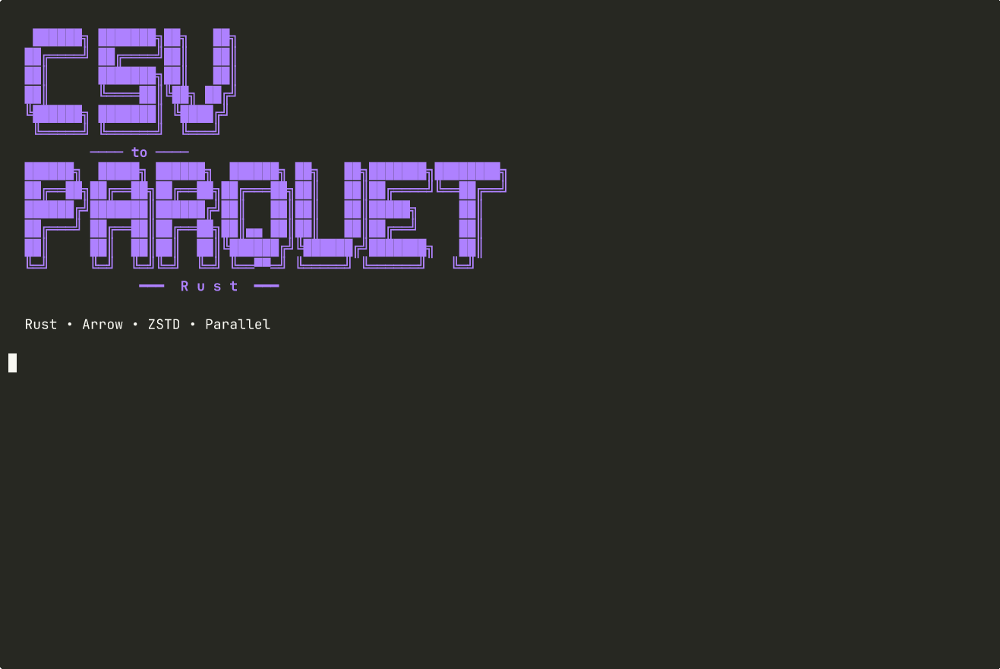

# 🦀 CSV to parquet

Convertisseur CSV/TSV → Parquet en Rust. Inférence automatique du schéma, compression ZSTD, traitement parallèle.



## 📘 Fonctionnement

Le programme lit un fichier tabulaire (CSV, TSV, ou tout délimiteur parmi `,` `;` `\t` `|`), infère le type de chaque colonne à partir d'un échantillon de 10 000 lignes, puis écrit un fichier Parquet compressé.

### Types inférés

| Type Parquet    | Conditions de détection                                              |
| --------------- | -------------------------------------------------------------------- |
| `Boolean`       | `true`/`false`, `yes`/`no`, `y`/`n`, `on`/`off`, `t`/`f`, `0`/`1`    |
| `Int64`         | Entiers signés dans la plage i64                                     |
| `UInt64`        | Entiers positifs dépassant i64 mais dans la plage u64                |
| `Float64`       | Nombres avec `.`, `e` ou `E`                                         |
| `Date32`        | Formats `YYYY-MM-DD`, `DD/MM/YYYY`, `MM/DD/YYYY`                     |
| `Timestamp(ms)` | RFC3339, `YYYY-MM-DD HH:MM:SS`, variantes avec fractions et timezone |
| `LargeUtf8`     | Tout ce qui ne correspond à aucun type ci-dessus                     |

Les valeurs `null`, `NULL`, `None`, `NaN`, `N/A`, `na`, `nd`, `nr`, `-`, `--` et les chaînes vides sont traitées comme des nulls quel que soit le type de la colonne.

### Détection automatique

Le délimiteur est détecté par comptage d'occurrences sur les 20 premières lignes. L'en-tête est détecté par heuristique (comparaison du profil de la première ligne avec les données). Si aucun en-tête n'est trouvé, des noms `col_0`, `col_1`, ... sont générés.

### Pipeline

```
Fichier CSV
    │
    ├─ Détection délimiteur
    ├─ Détection en-tête
    ├─ Inférence du schéma (échantillon 10 000 lignes)
    │
    ├─ Lecture par blocs de 100 000 lignes
    ├─ Conversion parallèle (rayon + crossbeam)
    ├─ Écriture ordonnée en Parquet (ZSTD niveau 5)
    │
    └─ Rapport de validation (cohérence lignes, taux nulls/erreurs par colonne)
```

## Installation

```bash
cargo build --release
```

Le binaire se trouve dans `target/release/csv_to_parquet`.

## Utilisation

### Conversion simple

```bash
csv_to_parquet fichier.csv
```

Produit `fichier.parquet` dans le même répertoire.

### TSV ou autre délimiteur

```bash
csv_to_parquet fichier.tsv
```

Le délimiteur est détecté automatiquement.

### Depuis stdin

```bash
cat fichier.csv | csv_to_parquet -
```

Produit `stdin.parquet` dans le répertoire courant.

### Options

```
--inferer-schema-complet   Analyse la totalité du fichier pour l'inférence
                           (plus lent mais plus précis sur les fichiers
                           où les types varient après les 10 000 premières lignes)

--force-utf8               Force toutes les colonnes en LargeUtf8
                           (désactive toute inférence, conserve les données brutes)

--view-schema              Affiche le schéma logique et physique d'un fichier Parquet

--man                      Génère la page de manuel au format roff
```

### Exemples

```bash
# Conversion avec inférence étendue
csv_to_parquet --inferer-schema-complet gros_fichier.csv

# Inspection du résultat
csv_to_parquet --view-schema gros_fichier.parquet

# Tout en texte (aucune perte sémantique possible)
csv_to_parquet --force-utf8 donnees_sales.csv

# Page de manuel
csv_to_parquet --man > csv_to_parquet.1
man ./csv_to_parquet.1
```

## Rapport de sortie

Chaque conversion produit un rapport sur stderr :

```
========== RAPPORT DE VALIDATION ==========

CSV lignes         1000000
Parquet lignes     1000000
Parsing erreurs          0
Lecture erreurs          0
Total erreurs            0
[OK] Cohérence validée

========== COLONNES ==========

nom                      type           null %      err %    valid %     conf
--------------------------------------------------------------------------------------
id                       Int64           0.00        0.00     100.00   100.00
prix                     Float64         0.50        0.00      99.50    99.50
date_vente               Date32          1.20        0.00      98.80    98.80
description              LargeUtf8       0.00        0.00     100.00   100.00
```

La colonne `err %` indique le pourcentage de valeurs non-null qui n'ont pas pu être converties vers le type inféré. Ces valeurs sont remplacées par des nulls dans le Parquet.

## Tests

```bash
cargo test
```

La suite de tests couvre l'inférence de schéma, les conversions de types, la gestion des nulls et erreurs, l'ordre strict d'écriture des blocs, le pipeline complet, et la détection de délimiteur.

Un script Python permet de tester sur des données générées :

```bash
python3 test_csv_to_parquet.py
```

Prérequis : `pyarrow` (`pip install pyarrow`).

## Démonstration

```bash
chmod +x demo.sh
asciinema rec demo.cast \
    --overwrite \
    --title "csv to parquet" \
    --cols 120 \
    --rows 34 \
    --command "bash demo.sh"
```

## Limites connues

- L'inférence est stricte : une seule valeur non conforme invalide le type pour toute la colonne. Une colonne avec 99.9% d'entiers et un texte sera inférée comme `LargeUtf8`.
- Les formats de date ambigus (`01/02/2024` : janvier 2 ou février 1 ?) sont testés dans l'ordre `DD/MM/YYYY` puis `MM/DD/YYYY`. Le premier qui parse gagne. Si les deux sont valides, `DD/MM/YYYY` est retenu.
- La détection d'en-tête est heuristique. Sur un fichier dont la première ligne de données ressemble structurellement à un en-tête (valeurs courtes, uniques, alphabétiques), un faux positif est possible.
- Pas de support des fichiers compressés en entrée (gzip, bzip2). Décompresser avant ou utiliser stdin : `zcat fichier.csv.gz | csv_to_parquet -`.

## Dépendances

| Crate                    | Rôle                           |
| ------------------------ | ------------------------------ |
| `arrow` / `parquet`      | Schéma Arrow, écriture Parquet |
| `csv`                    | Lecture CSV                    |
| `chrono`                 | Parsing dates et timestamps    |
| `rayon`                  | Parallélisme par blocs         |
| `crossbeam`              | Canaux bornés entre threads    |
| `clap`                   | Interface en ligne de commande |
| `indicatif`              | Barre de progression           |
| `anyhow`                 | Gestion d'erreurs              |
| `lexical-core`           | Parsing numérique rapide       |
| `owo-colors` / `colored` | Couleurs terminal              |
| `tempfile`               | Fichiers temporaires (stdin)   |

## Licence

Non spécifiée.
